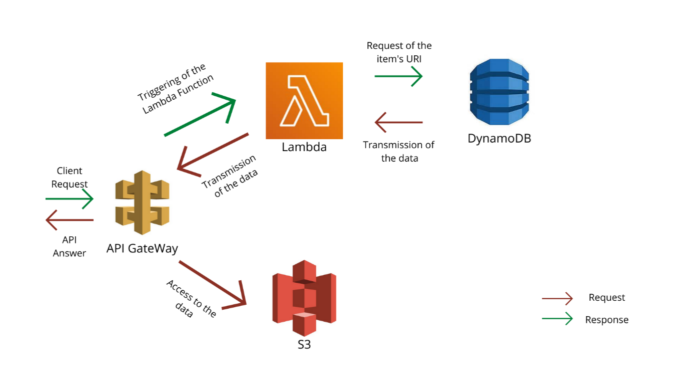

## Requirements

AWS Account with access to :
* [Amazon S3 (**S**imple **S**torage **S**ervice)](https://aws.amazon.com/fr/s3/)
* [Lambda](https://aws.amazon.com/fr/lambda/)
* [API Gateway](https://aws.amazon.com/fr/api-gateway/)
* [DynamoDB](https://aws.amazon.com/fr/dynamodb/)


## Installation procedure

### Brief presentation of the AWS components
In this project, we use 4 AWS components :
* Amazon S3 : It enables us to stock the items of the project (photos).
* Lambda : It is used to link the different components used in this project.
* API Gateway : The API that enables to make requests and get the information.
* DynamoDB : The database that stock the information of the items (we use S3 and DynamoDB in order to facilitate the modification of the S3 bucket and the request paths).

To better understand the links between the different entities, here is a schema of what happens when one makes a request to have information used in this project :



---
### Configuration

> For all the configurations, we recommend using the AWS region closest to you (*in our case, eu-west-3 | Europe Paris*)

We are going to start by configurating all the aws elements of the project and finish with the lambda. Every lambda function represents a functional feature that we want to implement.

---
#### ***S3 Configuration***

For this project, we need to do multiple steps for s3.
1. Create an "**S3**" bucket.

2. Change bucket policy and make the bucket private.

3. Create the "**Thumbnail**" and "**Optimized**" default folder.
---
##### **1. CREATE AN "S3" BUCKET**

* Go to your AWS console (https://s3.console.aws.amazon.com/s3/buckets?region=eu-west-3)
* Click on "**Create bucket**" : 
    <p align="left">
        
    </p>

* Configurate your bucket: 
    * Give a name (*for exemple "steatitebucket"*).
    * Make sure the region is the one you want to use.
    	<p align="left">
    		
     	</p>
	* Uncheck the **Block Public Access settings for this bucket** in order to allow the modification of the **Bucket policy** after the creation of the bucket.
	
        <p align="left">
		         	  
        </p>
		
	> Don't forget to check the fact that "*the current settings might result in this bucket and the objects within becoming public*"
	
    <p align="left">
		    
    </p>
    
 	* Click on "**Create bucket**" : 

        <p align="left">
			
		</p>

> Your bucket is ready!
---
##### **2. CHANGE BUCKET POLICY AND MAKE THE BUCKET PRIVATE.**

* In your bucket list, access your bucket by clicking on its name.
* Go to the "**Permissions**" tab.
 	<p align="left">
		
	</p>

* Scroll down to the "**Bucket policy**" part and click on "**Edit**".
* Copy this policy :

	```
	{
	   "Version":"2012-10-17",
	   "Statement":[
	      {
		 "Effect":"Allow",
		 "Principal": "*",
		 "Action":[
		    "s3:PutObject",
		    "s3:PutObjectAcl",
		    "s3:GetObject",
		    "s3:GetObjectAcl",
		    "s3:DeleteObject"
		 ],
		 "Resource":"arn:aws:s3:::steatitebucket/*"
	      }
	   ]
	}
	```
	> Change the "**Resource**" with your bucket name if it's not the same as the exemple.
* Click on "**Save changes**" :
	<p align="left">
		
	</p>
* Scroll down to the "**Block public access (bucket settings)**" part and click on "**Edit**".
* Check the "**Block all public access**" in order to protect your bucket.
	<p align="left">
		
	</p>
* Click on "**Save changes**" :
	<p align="left">
		
	</p>
* Confirm the modification.

> Your bucket is not fully ready and configured !

---

##### **3. CREATE THE "THUMBNAIL" AND "OPTIMIZED" DEFAULT FOLDER.**

* Click on "**Create folder**".
* Name it "**_Thumbnail_**".
* Click on "**Create folder**" to validate the creation. 
* Make the same with the "**_Optimized_**" folder.
* Here is how your bucket should looks like now :

	<p align="left">
		
	</p>
	
---
#### ***Lambda configuration***

All the lambda functions are already developed and available on the [Github Steatite's repository](https://github.com/Hypertopic/Steatite/tree/v7/src).

We can list 4 different functions :
* HandleFileAddedInS3
* getAttributes
* getOptimizedPicture
* getThumbnailOfImage

They will be explained later in each of there parts.

In order to add a lambda function, here is the steps to follow :
* Go to the [Lambda functions page](https://eu-west-3.console.aws.amazon.com/lambda/home?region=eu-west-3#/functions).
* Click on "**Create function**" :

    <p align="left">
        
    </p>
* Select "**Author from scratch**".
* Give the good name to the function, one of the name listed above.
* Choose "**Node.js 14.x**" as the runtime environment.
* In the "**Permissions**" tab, you will have a basic permission role for the function that will be created in your [IAM environment](https://us-east-1.console.aws.amazon.com/iamv2/home?region=us-east-1#/roles). Its name will be like "*functionname-role-randomstring"*.
    
    * The IAM permissions for a specific function are different, some need full access to DynamoDB, others to S3. This specification will be explained later in there function explanation. 
* Click on "**Create function**" :

    <p align="left">
        
    </p>
* You now have a brand new function, here is how you add the existing code :
    
    * On Github, go to the src/ folder, where all the functions are.
    * Click on the function you would like to copy.
    * Copy the URI of the function, for exemple *https://github.com/Hypertopic/Steatite/tree/v7/src/getAttributes*
    * We are going to use an external website to easily create our zip folder. Go on [GitZip](http://kinolien.github.io/gitzip/).
        
        * Paste your URI in the bar on the top of the page.
        * Click on "**Download**".
        * Your zip is now downloaded.
    * Go back to your function page, normally you are on the "Code" tab.
    * Click on the upper right button called "**Upload from**"
        <p align="left">
            
        </p>
    * Click on "**.zip file**".
    * Click on "**Upload**".
    * Go to your zip location and select it.
    * Click on "**Save**".

> The function is now uploaded into Lambda, some of our functions need modules to work, so they will not be visible in the "Code source" part under the "Code" tab because they are too large. 

Do the same thing for all the functions and then we will configure the IAM permissions for each of them.

##### ***Adding environment variables***

We are going to add environment variables in some of our functions in order to make our code dynamic and avoid useless code modification.

For each of the next functions :
1. Go to the function in Lambda.
2. Go to the "**Configuration**" tab.
3. Click on "**Edit**" on "**Environment variables**".
4. Add the attributes.
5. Click on "**Save**".

**HandleFileAddedInS3**

* [Key name : DynamoDBTableName;
Value : The name of your DynamoDB table.]

**getAttributes**

* [Key name : DynamoDBTableName;
Value : The name of your DynamoDB table.]

**getOptimizedPicture**

* [Key name : DynamoDBTableName;
Value : The name of your DynamoDB table.]

* [Key name : S3BucketName;
Value : The name of your S3 bucket.]

**getThumbnailOfImage**

* [Key name : DynamoDBTableName;
Value : The name of your DynamoDB table.]

* [Key name : S3BucketName;
Value : The name of your S3 bucket.]

---
##### ***IAM PERMISSIONS***

In order to access to your IAM role for a specific function :
*  Access to the [IAM role page](https://us-east-1.console.aws.amazon.com/iamv2/home#/roles).
* Click on your role name.

**OR**
*  Directly access to your role via your Lambda function page.

    * Go to the "**Configuration**" tab.
    * Click on "**Permissions**" on the left tab.
    * In the "**Execution role**", click on your role name.

        <p align="left">
            
        </p>

> You are now on your role page. The different permissions are listed below.  
You can also see that you have normally a default permission called ***AWSLambdaBasicExecutionRole***.

If you want to add a permission to a role :

* Click on the upper right button "**Add permissions**".
* Select "**Attach policies**".
* You can filter by the name you want and select multiples policies.
* Once you are finished with your selection, click on the lower right button "**Attach policies**".
* Your policies are not attached to your role.

**HandleFileAddedInS3**

We will need for this function :
   
* Full access on S3 called ***AmazonS3FullAccess***
* Full access on AmazonDB called ***AmazonDynamoDBFullAccess***

**getAttributes**

We will need for this function :
   
* Full access on S3 called ***AmazonS3FullAccess***
* Full access on AmazonDB called ***AmazonDynamoDBFullAccess***

**getOptimizedPicture**

* Full access on S3 called ***AmazonS3FullAccess***
* Full access on AmazonDB called ***AmazonDynamoDBFullAccess***

**getThumbnailOfImage**

* Full access on S3 called ***AmazonS3FullAccess***
* Full access on AmazonDB called ***AmazonDynamoDBFullAccess***

---
#### ***DynamoDB configuration***

In this part, we are going to create and configure the table that will store datas used later in lambda functions.

1. Go on "**Tables**" tab at this [link](https://eu-west-3.console.aws.amazon.com/dynamodbv2/home?region=eu-west-3#tables).
2. Click on "**Create table**".
3. Enter whatever you want as the table name.
4. Enter "**hash**" as the partition key, let the default type which is *String*.
5. Let the default settings and click on "**Create table**".
6. Your table will be available when the status attribute goes to "**Active**", it could take few seconds.
---
#### ***API Gateway configuration***

Here we are going to configure our api calls, we will use a json file in order to facilitate the configuration.

```json
{
  "swagger" : "2.0",
  "info" : {
    "version" : "2022-06-15T16:37:00Z",
    "title" : "Steatite"
  },
  "host" : "rzi0pem2eh.execute-api.eu-west-3.amazonaws.com",
  "basePath" : "/Steatite",
  "schemes" : [ "https" ],
  "paths" : {
    "/item/{corpus}/{hash+}" : {
      "get" : {
        "produces" : [ "application/json" ],
        "parameters" : [ {
          "name" : "corpus",
          "in" : "path",
          "required" : true,
          "type" : "string"
        }, {
          "name" : "hash",
          "in" : "path",
          "required" : true,
          "type" : "string"
        } ],
        "responses" : {
          "200" : {
            "description" : "200 response",
            "schema" : {
              "$ref" : "#/definitions/Empty"
            }
          }
        }
      }
    },
    "/optimized/{hash+}" : {
      "x-amazon-apigateway-any-method" : {
        "produces" : [ "image/jpeg" ],
        "parameters" : [ {
          "name" : "hash",
          "in" : "path",
          "required" : true,
          "type" : "string"
        } ],
        "responses" : {
          "200" : {
            "description" : "200 response",
            "schema" : {
              "$ref" : "#/definitions/ImageJPEG"
            },
            "headers" : {
              "Content-Type" : {
                "type" : "string"
              }
            }
          }
        }
      }
    },
    "/thumbnail/{hash+}" : {
      "x-amazon-apigateway-any-method" : {
        "produces" : [ "image/jpeg" ],
        "parameters" : [ {
          "name" : "hash",
          "in" : "path",
          "required" : true,
          "type" : "string"
        } ],
        "responses" : {
          "200" : {
            "description" : "200 response",
            "schema" : {
              "$ref" : "#/definitions/ImageJPEG"
            },
            "headers" : {
              "Content-Type" : {
                "type" : "string"
              }
            }
          }
        }
      }
    }
  },
  "definitions" : {
    "Empty" : {
      "type" : "object",
      "title" : "Empty Schema"
    },
    "ImageJPEG" : { }
  }
}
```

1. On your laptop, create a file called "*Steatite-swagger.json*" and paste the code above.
2. Go on the [API Gateway page](https://eu-west-3.console.aws.amazon.com/apigateway/main/apis?region=eu-west-3).
3. Click on "**Create API**".
4. You now have a list of different solution, we will use "**REST API**", be careful, do not choose "**REST API Private**". Click on "**Import**".
5. Click on "**Select Swagger File**".
6. Select the file you created called "*Steatite-swagger.json*".
7. Click on "**Import**".

You now have this view :
        <p align="left">
            
        </p>
We are no going to configure each of API calls.

**/item/{corpus}/{hash+}**

1. Click on "**GET**".
2. In the Lambda Function input, write "**getAttributes**" and select it.
3. Click on "**Ok**" in order to add the correct permissions to the Lambda function.

**+/optimized/{hash+}**

1. Click on "**ANY**".
2. In the Lambda Function input, write "**getOptimizedPicture**" and select it.
3. Click on "**Ok**" in order to add the correct permissions to the Lambda function.

**+/thumbnail/{hash+}**

1. Click on "**ANY**".
2. In the Lambda Function input, write "**getThumbnailOfImage**" and select it.
3. Click on "**Ok**" in order to add the correct permissions to the Lambda function.

> Now that all the functions are configured, we can deploy our API.

1. Click on "**Actions**".
2. In the "**API ACTIONS**" tab, click on "**Deploy API**".
3. In the "**Deployment stage**" select "**[New stage]**".
4. In "**Stage name**", you can put whatever you want, "**Steatite**" seems fine. 
5. Click on "**Deploy**".

> The API should be deployed now, here is the view :

<p align="left">
    
</p>

> VERY IMPORTANT

We need to add the type of binary files accepted by the API in order to allow our response to send images when we will call for the optimized and the thumbnail image.

1. In your API, click on "**Settings**" in the left menu.
2. Scroll down to "**Binary Media Types**".
3. Add this configuration : 

    <p align="left">
      
    </p>
4. Go to "**Resources**" and deploy your API.

> We now want to add an image to the S3 bucket (into a folder which will take the name of the corpus).

### Test phase

#### **Add a file to S3 and verify if it added in the Thumbnail folder**

In order to execute our Lambda function "**HandleFileAddedInS3**", we need to link it with our S3 bucket. Here is how we do it :

1. Go to "[**S3**](https://s3.console.aws.amazon.com/s3/buckets?region=eu-west-3&region=eu-west-3)".
2. Enter your bucket by clicking on it.
3. Go to the "**Properties**" tab.
4. Scroll down to "**Event notifications**".
5. Click on "**Create event notification**".
6. Give it a name, such as "**HandleFileAddedInS3Event**".
6. In the "**Event types**", select "**All object create events**".
7. In "**Destination**", Select your Lambda function name (*HandleFileAddedInS3*).
8. Click on "**Save changes**".

Now we want to see if we can add a file and make it automatically pasted in the thumbnail folder.

1. Go to "[**S3**](https://s3.console.aws.amazon.com/s3/buckets?region=eu-west-3&region=eu-west-3)".
2. Enter your bucket by clicking on it.
3. Click on "**Create folder**" in order to name your corpus.
4. Click on the folder created to enter it.
5. Click on "**Upload**".
6. Select a photo.
7. Click on "**Upload**".
8. When the upload is successful, you will have a green message with "**Upload succeeded**".
9. Click on "**Close**".

The image should be here, in your brand new folder. Now we want to verify if the file was pasted as a thumbnail in the folder.

1. Go back to your main page of your bucket.
2. Click on "**Thumbnail**".

> So now you have a file added in a corpus and one is added in the thumbnail folder. We want to verify if it is well added in the table in DynamoDB, and if the api calls work.

---
#### **Check if a file is well added in the picture table in DynamoDB**

1. Go to the "[Tables](https://eu-west-3.console.aws.amazon.com/dynamodbv2/home?region=eu-west-3#tables)" page.
2. Access it by clicking on it.
3. Click on "**Explore table items**".
4. You should see a line with the same hash and the corpus.

> Now that the file is well added in DynamoDB, let's check if we can make our API calls.

---
#### **Check if our API Gateway calls work**

1. Go to [API Gateway](https://eu-west-3.console.aws.amazon.com/apigateway/main/apis?region=eu-west-3).
2. Access your API by clicking on it.
3. Go to "**Stages**" on the left menu.
4. Open the menu of your API by clicking on it.

**/item/{corpus}/{hash+}**

1. Click on "**GET**".
2. Click on the "**Invoke URL**" link. 
3. Replace corpus by the corpus name and the hash by the right hash.
> Go to your DynamoDB table in order to know it.
4. You should have this kind of JSON response :
    
    <p align="left">
      
   </p>
---

**/optimized/{hash+}**

For this part you can use the JSON response you had before and copy paste the "**optimized**" attribute value.

You should receive the optimized version of your image.

**/thumbnail/{hash+}**

For this part you can use the JSON response you had before and copy paste the "**thumbnail**" attribute value.

You should receive the thumbnail of your image.